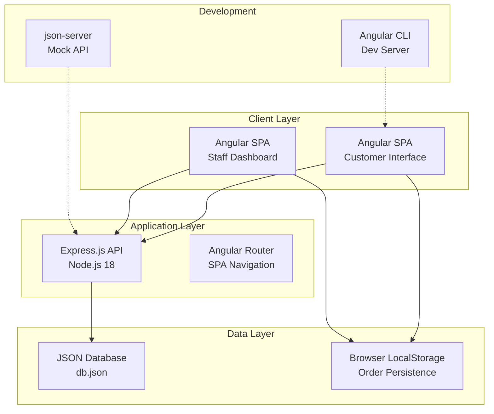

# Brew & Bean Coffee Co. Angular POC Architecture Document

## Introduction

This document outlines the complete technical architecture for the Brew & Bean Coffee Co. Customer Experience POC, focusing on an Angular-based solution with Node.js 18, dummy database (db.json), and simplified UI. The architecture is designed to demonstrate digital ordering capability, reduce customer wait times from 8 minutes to under 3 minutes, and validate the technical feasibility of Angular for future full-scale development.

### Starter Template Assessment
**N/A - Greenfield project** - This is a new Angular POC built from scratch using Angular CLI with no existing templates or codebases.

### Change Log
| Date | Version | Description | Author |
|------|---------|-------------|---------|
| 2025-09-25 | 1.0 | Initial architecture document creation | Winston (Architect) |

## High Level Architecture

### Technical Summary
The Brew & Bean Coffee Co. POC employs a single-page application (SPA) architecture using Angular 17+ with a Node.js 18 backend serving a JSON-based mock database. The frontend features a component-driven design with Angular Material UI, while the backend provides RESTful APIs using Express.js with json-server for rapid prototyping. The system is optimized for local development and simple static hosting deployment, focusing on demonstrating core ordering workflows rather than production scalability.

### Platform and Infrastructure Choice
**Platform:** Local Development with Static Hosting Option
**Key Services:** Angular CLI Dev Server, json-server, Netlify/Vercel (deployment)
**Deployment Host and Regions:** Local development, Optional: Netlify/Vercel global CDN

### Repository Structure
**Structure:** Monorepo with separate frontend/backend directories
**Monorepo Tool:** npm workspaces (simplest for POC)
**Package Organization:** apps/frontend (Angular), apps/backend (Node.js), shared types

### High Level Architecture Diagram


### Architectural Patterns
- **Single Page Application (SPA):** Angular-based client-side routing and state management
- **Component-Based Architecture:** Reusable Angular components with TypeScript
- **RESTful API Pattern:** Express.js endpoints with JSON responses
- **Mock Database Pattern:** json-server providing REST API over JSON file
- **Service Layer Pattern:** Angular services for business logic and API communication

## Tech Stack

### Technology Stack Table

| Category | Technology | Version | Purpose | Rationale |
|----------|------------|---------|---------|-----------|
| Frontend Language | TypeScript | 5.2+ | Type-safe Angular development | Strong typing prevents runtime errors |
| Frontend Framework | Angular | 17+ | SPA framework with component architecture | Enterprise-grade framework with CLI tools |
| UI Component Library | Angular Material | 17+ | Consistent, accessible UI components | Professional look with built-in accessibility |
| State Management | Angular Services + RxJS | 17+ / 7.8+ | Reactive state management | Built-in Angular patterns for POC |
| Backend Language | TypeScript | 5.2+ | Type-safe server development | Consistent typing across full stack |
| Backend Framework | Express.js | 4.18+ | REST API server | Lightweight, excellent for prototyping |
| API Style | REST | - | HTTP API pattern | Simple, works with json-server |
| Database | json-server + JSON file | 0.17+ | Mock database for POC | Rapid development without DB setup |
| Cache | Browser Cache + LocalStorage | Native | Client-side persistence | Built-in browser capabilities |
| Frontend Testing | Jasmine + Karma | Angular defaults | Unit and component testing | Built into Angular CLI |
| Backend Testing | Jest | 29+ | API and service testing | Popular testing framework |
| E2E Testing | Cypress | 13+ | End-to-end user flow testing | Reliable E2E testing |
| Build Tool | Angular CLI | 17+ | Build, dev server, optimization | Official Angular tooling |
| CI/CD | GitHub Actions | - | Automated testing and deployment | Free, GitHub integrated |
| CSS Framework | Angular Material + Custom | - | Styling framework | Material Design with branding |

## Data Models

### MenuItem
```typescript
interface MenuItem {
  id: string;
  name: string;
  description: string;
  category: 'Coffee' | 'Tea' | 'Pastries' | 'Beverages';
  basePrice: number;
  sizes: SizeOption[];
  customizations: CustomizationOption[];
  image: string;
  isPopular: boolean;
  isAvailable: boolean;
}

interface SizeOption {
  id: string;
  name: 'Small' | 'Medium' | 'Large';
  priceModifier: number;
}

interface CustomizationOption {
  id: string;
  name: string;
  type: 'milk' | 'sweetener' | 'temperature' | 'extras';
  options: CustomizationChoice[];
}
```

### Order
```typescript
interface Order {
  id: string;
  customerId: string;
  items: OrderItem[];
  totalPrice: number;
  status: OrderStatus;
  timestamp: Date;
  estimatedReadyTime: Date;
  specialInstructions?: string;
}

interface OrderItem {
  id: string;
  menuItemId: string;
  menuItemName: string;
  selectedSize: SizeOption;
  selectedCustomizations: CustomizationChoice[];
  quantity: number;
  itemPrice: number;
}

type OrderStatus = 'New' | 'In Progress' | 'Ready' | 'Completed';
```

## API Specification

### REST API Specification
```yaml
openapi: 3.0.0
info:
  title: Brew & Bean Coffee Co. API
  version: 1.0.0
  description: POC API for coffee ordering system
servers:
  - url: http://localhost:3001/api
    description: Local development server

paths:
  /menu:
    get:
      summary: Get all menu items
      responses:
        '200':
          description: List of menu items
          content:
            application/json:
              schema:
                type: array
                items:
                  $ref: '#/components/schemas/MenuItem'

  /orders:
    post:
      summary: Create new order
      requestBody:
        required: true
        content:
          application/json:
            schema:
              $ref: '#/components/schemas/Order'
      responses:
        '201':
          description: Order created successfully

    get:
      summary: Get all orders (staff dashboard)
      responses:
        '200':
          description: List of orders
          content:
            application/json:
              schema:
                type: array
                items:
                  $ref: '#/components/schemas/Order'

  /orders/{id}:
    patch:
      summary: Update order status
      parameters:
        - name: id
          in: path
          required: true
          schema:
            type: string
      requestBody:
        required: true
        content:
          application/json:
            schema:
              type: object
              properties:
                status:
                  $ref: '#/components/schemas/OrderStatus'
      responses:
        '200':
          description: Order updated successfully
```

## Components

### MenuService
**Responsibility:** Manages menu data retrieval, caching, and filtering operations

**Key Interfaces:**
- getMenuItems(): Observable<MenuItem[]>
- getMenuItemById(id: string): Observable<MenuItem>
- filterByCategory(category: string): Observable<MenuItem[]>

**Dependencies:** HttpClient, LocalStorageService

**Technology Stack:** Angular Service with RxJS observables

### OrderService
**Responsibility:** Handles order creation, status tracking, and persistence

**Key Interfaces:**
- createOrder(order: Order): Observable<Order>
- updateOrderStatus(id: string, status: OrderStatus): Observable<Order>
- getOrders(): Observable<Order[]>

**Dependencies:** HttpClient, LocalStorageService

**Technology Stack:** Angular Service with HTTP communication

### CustomerMenuComponent
**Responsibility:** Displays menu items with filtering and search capabilities

**Key Interfaces:**
- Menu display grid/list view
- Category filtering
- Search functionality

**Dependencies:** MenuService, Router

**Technology Stack:** Angular Component with Material Design

### OrderBuilderComponent
**Responsibility:** Manages order customization and cart functionality

**Key Interfaces:**
- Item customization interface
- Real-time price calculation
- Add to cart functionality

**Dependencies:** OrderService, MenuService

**Technology Stack:** Angular Component with reactive forms

### StaffDashboardComponent
**Responsibility:** Provides order queue management for staff

**Key Interfaces:**
- Order queue display
- Status update controls
- Order detail views

**Dependencies:** OrderService

**Technology Stack:** Angular Component with real-time updates

## Frontend Architecture

### Component Architecture
```
src/
├── app/
│   ├── components/
│   │   ├── customer/
│   │   │   ├── menu/
│   │   │   ├── order-builder/
│   │   │   └── order-confirmation/
│   │   ├── staff/
│   │   │   ├── dashboard/
│   │   │   └── order-detail/
│   │   └── shared/
│   │       ├── header/
│   │       ├── footer/
│   │       └── loading/
│   ├── services/
│   │   ├── menu.service.ts
│   │   ├── order.service.ts
│   │   └── local-storage.service.ts
│   ├── models/
│   │   ├── menu-item.interface.ts
│   │   ├── order.interface.ts
│   │   └── index.ts
│   └── routing/
│       └── app-routing.module.ts
```

### State Management Architecture
```typescript
// Simple service-based state management for POC
@Injectable({ providedIn: 'root' })
export class AppStateService {
  private ordersSubject = new BehaviorSubject<Order[]>([]);
  private menuItemsSubject = new BehaviorSubject<MenuItem[]>([]);

  orders$ = this.ordersSubject.asObservable();
  menuItems$ = this.menuItemsSubject.asObservable();

  updateOrders(orders: Order[]): void {
    this.ordersSubject.next(orders);
  }

  updateMenuItems(items: MenuItem[]): void {
    this.menuItemsSubject.next(items);
  }
}
```

### Routing Architecture
```typescript
const routes: Routes = [
  { path: '', redirectTo: '/menu', pathMatch: 'full' },
  { path: 'menu', component: CustomerMenuComponent },
  { path: 'order-builder/:itemId', component: OrderBuilderComponent },
  { path: 'order-confirmation', component: OrderConfirmationComponent },
  { path: 'staff', component: StaffDashboardComponent },
  { path: '**', redirectTo: '/menu' }
];
```

## Backend Architecture

### Service Architecture
```
backend/
├── src/
│   ├── routes/
│   │   ├── menu.routes.ts
│   │   └── orders.routes.ts
│   ├── services/
│   │   ├── menu.service.ts
│   │   └── order.service.ts
│   ├── middleware/
│   │   ├── cors.middleware.ts
│   │   └── error.middleware.ts
│   ├── data/
│   │   └── db.json
│   └── app.ts
├── package.json
└── tsconfig.json
```

### Database Architecture (Mock)
```json
{
  "menuItems": [
    {
      "id": "1",
      "name": "Classic Espresso",
      "description": "Rich, bold espresso shot",
      "category": "Coffee",
      "basePrice": 2.50,
      "sizes": [...],
      "customizations": [...],
      "image": "/assets/images/espresso.jpg",
      "isPopular": true,
      "isAvailable": true
    }
  ],
  "orders": [],
  "customers": []
}
```

## Unified Project Structure

```
brew-bean-poc/
├── apps/
│   ├── frontend/                 # Angular Application
│   │   ├── src/
│   │   │   ├── app/
│   │   │   │   ├── components/
│   │   │   │   │   ├── customer/
│   │   │   │   │   ├── staff/
│   │   │   │   │   └── shared/
│   │   │   │   ├── services/
│   │   │   │   ├── models/
│   │   │   │   └── routing/
│   │   │   ├── assets/
│   │   │   │   └── images/
│   │   │   └── styles/
│   │   ├── angular.json
│   │   └── package.json
│   └── backend/                  # Node.js API
│       ├── src/
│       │   ├── routes/
│       │   ├── services/
│       │   ├── middleware/
│       │   ├── data/
│       │   │   └── db.json
│       │   └── app.ts
│       └── package.json
├── shared/                       # Shared TypeScript types
│   ├── src/
│   │   ├── interfaces/
│   │   └── constants/
│   └── package.json
├── docs/
│   ├── prd.md
│   └── architecture.md
├── .github/
│   └── workflows/
│       └── ci.yml
├── package.json                  # Root workspace config
└── README.md
```

## Development Workflow

### Prerequisites
```bash
# Required software
node --version  # Should be 18+
npm --version   # Should be 9+
ng version      # Angular CLI 17+
```

### Initial Setup
```bash
# Clone and setup workspace
git clone <repository-url>
cd brew-bean-poc
npm install

# Setup Angular frontend
cd apps/frontend
ng build
cd ../..

# Setup Node.js backend
cd apps/backend
npm install
cd ../..
```

### Development Commands
```bash
# Start all services concurrently
npm run dev

# Start frontend only (port 4200)
npm run dev:frontend

# Start backend only (port 3001)
npm run dev:backend

# Run all tests
npm run test

# Build for production
npm run build
```

### Environment Configuration
```bash
# Frontend (.env.local)
ANGULAR_API_URL=http://localhost:3001/api
ANGULAR_ENVIRONMENT=development

# Backend (.env)
PORT=3001
JSON_DB_PATH=./src/data/db.json
CORS_ORIGIN=http://localhost:4200

# Shared
NODE_ENV=development
```

## Deployment Architecture

### Deployment Strategy
**Frontend Deployment:**
- **Platform:** Netlify/Vercel static hosting
- **Build Command:** `ng build --prod`
- **Output Directory:** `dist/frontend`
- **CDN/Edge:** Global CDN distribution

**Backend Deployment:**
- **Platform:** Heroku/Railway (for POC)
- **Build Command:** `npm run build`
- **Deployment Method:** Git-based deployment

### CI/CD Pipeline
```yaml
name: CI/CD Pipeline
on: [push, pull_request]
jobs:
  test:
    runs-on: ubuntu-latest
    steps:
      - uses: actions/checkout@v3
      - uses: actions/setup-node@v3
        with:
          node-version: 18
      - run: npm ci
      - run: npm run test
      - run: npm run build
```

### Environments
| Environment | Frontend URL | Backend URL | Purpose |
|-------------|-------------|-------------|---------|
| Development | http://localhost:4200 | http://localhost:3001 | Local development |
| Staging | https://staging.brewbean.app | https://api-staging.brewbean.app | Pre-production testing |
| Production | https://brewbean.app | https://api.brewbean.app | Live environment |

## Security and Performance

### Security Requirements
**Frontend Security:**
- CSP Headers: Strict content security policy
- XSS Prevention: Angular's built-in sanitization
- Secure Storage: LocalStorage for non-sensitive data only

**Backend Security:**
- Input Validation: Express validator middleware
- Rate Limiting: Basic rate limiting for API endpoints
- CORS Policy: Restricted to frontend domain

### Performance Optimization
**Frontend Performance:**
- Bundle Size Target: <500KB initial bundle
- Loading Strategy: Lazy loading for staff dashboard
- Caching Strategy: Service worker for static assets

**Backend Performance:**
- Response Time Target: <200ms for API calls
- Database Optimization: In-memory JSON operations
- Caching Strategy: HTTP caching headers

## Testing Strategy

### Test Organization
```
Frontend Tests:
├── src/app/components/__tests__/
├── src/app/services/__tests__/
└── cypress/e2e/

Backend Tests:
├── src/routes/__tests__/
├── src/services/__tests__/
└── integration/

E2E Tests:
└── cypress/e2e/
    ├── customer-ordering.cy.ts
    └── staff-dashboard.cy.ts
```

### Test Examples
```typescript
// Frontend Component Test
describe('MenuComponent', () => {
  it('should display menu items', () => {
    const fixture = TestBed.createComponent(MenuComponent);
    const component = fixture.componentInstance;
    expect(component.menuItems.length).toBeGreaterThan(0);
  });
});

// Backend API Test
describe('Menu API', () => {
  it('should return menu items', async () => {
    const response = await request(app).get('/api/menu');
    expect(response.status).toBe(200);
    expect(response.body.length).toBeGreaterThan(0);
  });
});

// E2E Test
describe('Customer Ordering Flow', () => {
  it('should complete order from menu to confirmation', () => {
    cy.visit('/menu');
    cy.get('[data-cy=menu-item]').first().click();
    cy.get('[data-cy=add-to-cart]').click();
    cy.get('[data-cy=checkout]').click();
    cy.get('[data-cy=order-confirmation]').should('exist');
  });
});
```

## Coding Standards

### Critical Fullstack Rules
- **Type Sharing:** Always define types in shared/ and import from there
- **API Calls:** Never make direct HTTP calls - use the service layer
- **Environment Variables:** Access only through config objects, never process.env directly
- **Error Handling:** All API routes must use the standard error handler
- **State Updates:** Never mutate state directly - use proper Angular patterns

### Naming Conventions
| Element | Frontend | Backend | Example |
|---------|----------|---------|---------|
| Components | PascalCase | - | `MenuComponent.ts` |
| Services | PascalCase with Service | PascalCase with Service | `MenuService.ts` |
| API Routes | - | kebab-case | `/api/menu-items` |
| Database Fields | - | camelCase | `menuItems` |

## Error Handling Strategy

### Error Response Format
```typescript
interface ApiError {
  error: {
    code: string;
    message: string;
    details?: Record<string, any>;
    timestamp: string;
    requestId: string;
  };
}
```

### Frontend Error Handling
```typescript
@Injectable()
export class ErrorHandlerService {
  handleError(error: any): void {
    console.error('Application Error:', error);
    // Show user-friendly message
    this.snackBar.open('Something went wrong. Please try again.', 'Close');
  }
}
```

### Backend Error Handling
```typescript
export const errorHandler = (err: Error, req: Request, res: Response, next: NextFunction) => {
  const errorResponse: ApiError = {
    error: {
      code: 'INTERNAL_ERROR',
      message: err.message,
      timestamp: new Date().toISOString(),
      requestId: req.id || 'unknown'
    }
  };
  res.status(500).json(errorResponse);
};
```

## Monitoring and Observability

### Monitoring Stack
- **Frontend Monitoring:** Console logging with error boundaries
- **Backend Monitoring:** Console logging with request/response logging
- **Error Tracking:** Basic console error logging for POC
- **Performance Monitoring:** Browser DevTools and Network tab

### Key Metrics
**Frontend Metrics:**
- Page load times
- Component render times
- API response times
- User interaction events

**Backend Metrics:**
- Request rate
- Response time
- Error rate
- Memory usage

---

🏗️ **Architecture Complete**

This comprehensive Angular POC architecture provides a solid foundation for the Brew & Bean Coffee Co. digital transformation initiative. The design prioritizes rapid development and clear demonstration of core functionality while maintaining professional standards and scalability potential for future production implementation.